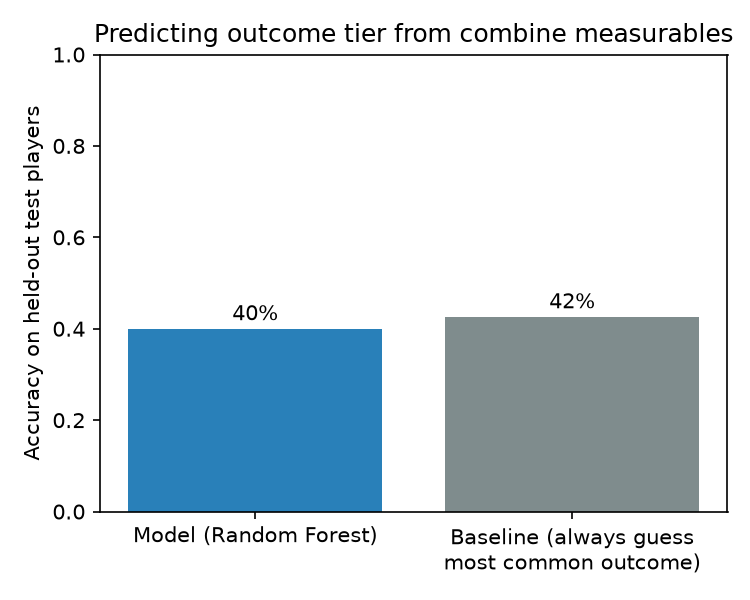
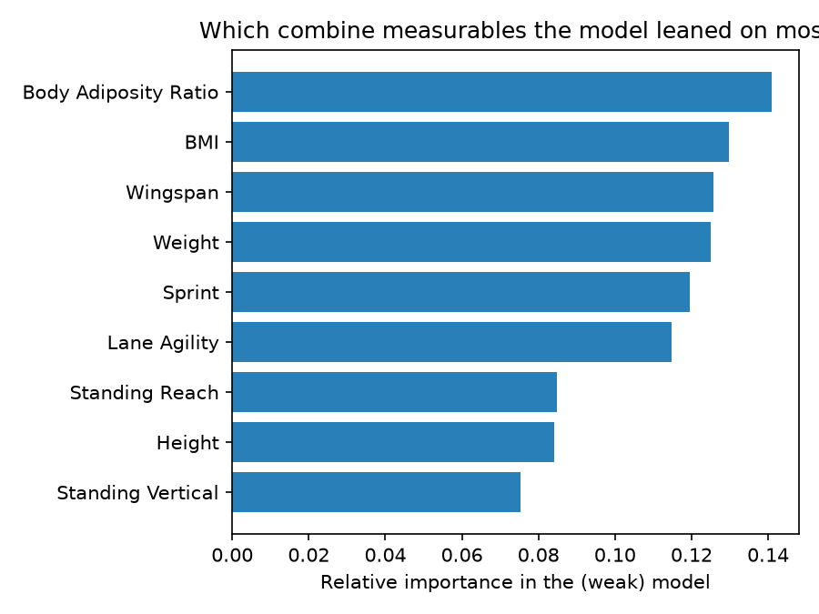
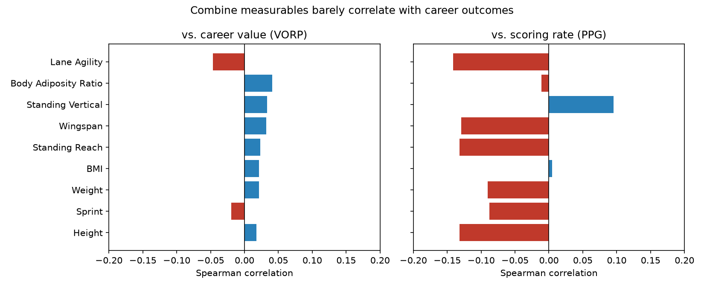
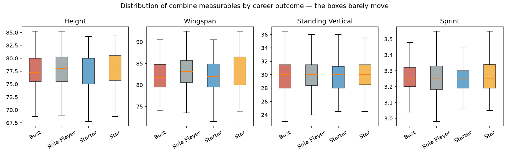

# Do NBA Combine Scores Predict Career Success?
This report evaluates whether pre-draft NBA Combine measurables (height, weight, wingspan, vertical leap, agility, sprint speed, etc.) predict how a player's career actually turns out.
## Data
- Raw combine records: 1,678 prospects (2000–2025).
- Raw career-average records: 1,868 drafted players (1990–2021).
- **Matched players (appear in both files): 763.** Only these players are used anywhere in this analysis — a combine prospect with no career record has no outcome to learn from, and a career player with no combine record has no measurables to predict from, so neither belongs in the dataset. See `backend/preprocess_data.py` for the name-matching logic (accent normalization + draft-year tolerance to resolve players who share a name).
- Outcome label (`category`): each player's career **VORP** (Value Over Replacement Player, a standard cumulative advanced stat combining quality of play and playing time) is bucketed into quartile/decile-based tiers: **Bust** (bottom 25%), **Role Player** (25th–70th percentile), **Starter** (70th–90th), **Star** (top 10%). Cutoffs come from the data's own distribution, not hand-picked thresholds.
| Category | Players |
|---|---|
| Bust | 211 |
| Role Player | 324 |
| Starter | 151 |
| Star | 77 |

## Can a model predict the outcome tier from combine measurables?
A Random Forest classifier was trained on 9 combine measurables (height, weight, BMI, wingspan, standing reach, body adiposity ratio, standing vertical, lane agility, sprint) to predict the four-tier outcome category, on a held-out test set of 153 players (trained on 610).
- **Model accuracy: 39.9%**
- **Baseline accuracy (always guess "Role Player", the most common outcome): 42.5%**
- 5-fold cross-validated accuracy: 40.4% ± 1.2%

**The model does not beat the naive baseline.** In the test set it essentially collapsed to predicting "Role Player" for almost everyone (see confusion matrix in `data/processed/metrics.json`), correctly identifying 0 of the Stars and 0 of the Starters. Combine measurables alone do not give the model enough signal to separate future stars or busts from the middle of the pack.

## Do individual measurables correlate with career outcomes?
Spearman correlation between each measurable and (a) career VORP and (b) career PPG, across all 763 matched players:

- **Vs. career value (VORP): 0 of 9 measurables reach statistical significance (p < 0.05).** The strongest is Lane Agility at r = -0.047 — a correlation so close to zero it has no practical use. Combine measurables essentially do not predict how good a player's career turns out to be.
- **Vs. scoring rate (PPG): 7 of 9 measurables reach statistical significance**, but the effect sizes are still small (strongest: Lane Agility, r = -0.142). The sign is informative, though: height, wingspan, standing reach and lane-agility time all correlate *negatively* with PPG. This isn't measurables predicting talent — it's measurables predicting **position**. Taller, longer players are more often centers/forwards who score less per game than guards, regardless of how good they are.

The box plots make the same point visually: the distribution of height, wingspan, vertical leap and sprint time is nearly identical whether a player ended up a Bust or a Star. The boxes barely move across categories.

## Conclusion
**No — on their own, NBA Combine measurables do not meaningfully predict whether a prospect becomes a star, a solid role player, or a bust.** A model given only height, weight, wingspan, vertical leap, agility and sprint data cannot beat the trivial strategy of guessing the most common outcome for every player, and none of the individual measurables show a correlation with career value worth acting on. What the combine *does* capture is closer to **body type and position** than **talent or ceiling** — a longer, bigger player is more likely to be used as a big man who scores less per game, but that says nothing about whether he'll be good at that job. Draft evaluators lean on the combine for a reason (durability, positional fit, medical flags), but as a stand-alone predictor of career outcome, it has essentially no signal in this dataset.

*Caveat:* this analysis uses only 9 physical/athletic testing measurables. It does not include college production, age, or scouting grades, any of which would likely predict career outcome far better than the combine alone.
